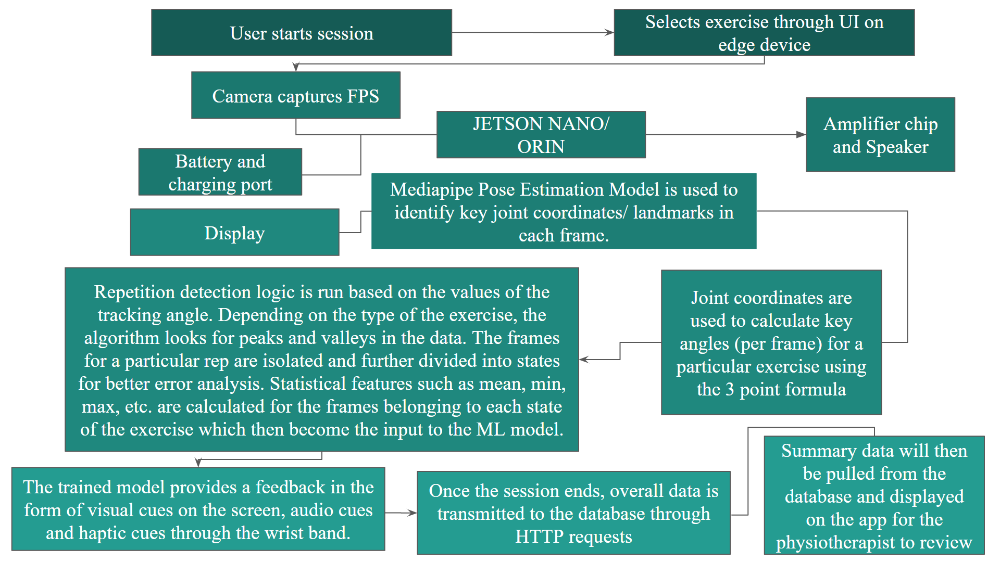
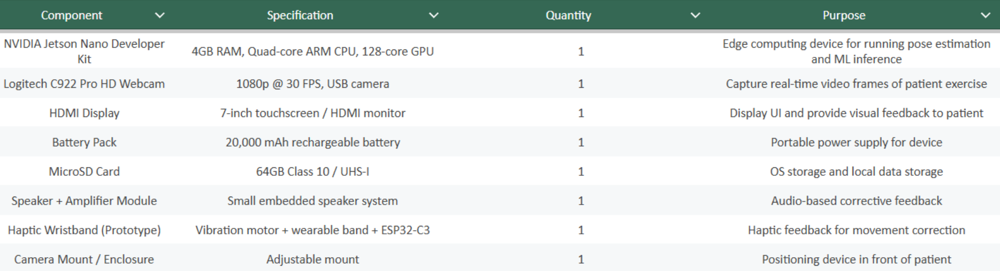
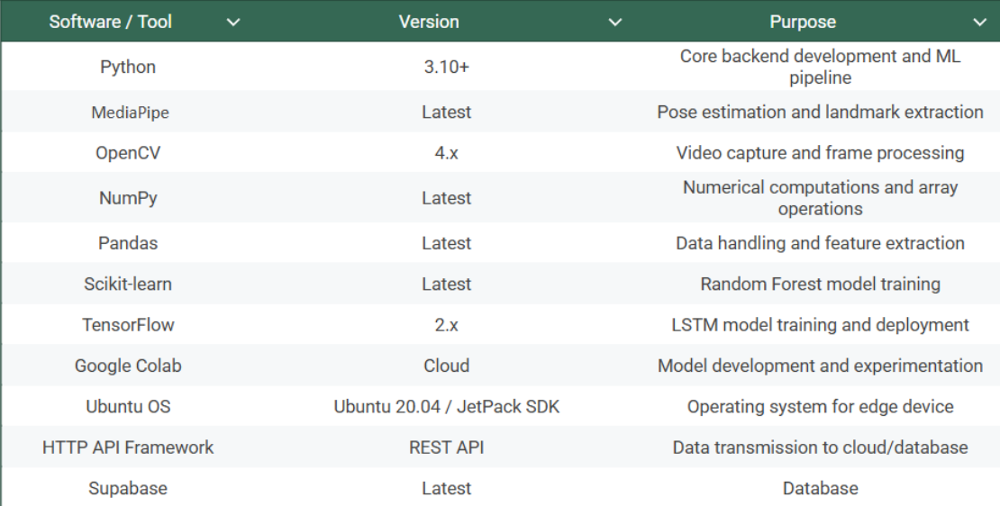
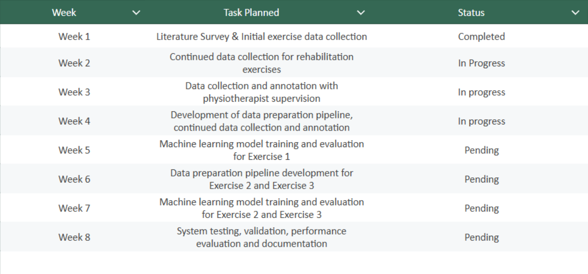
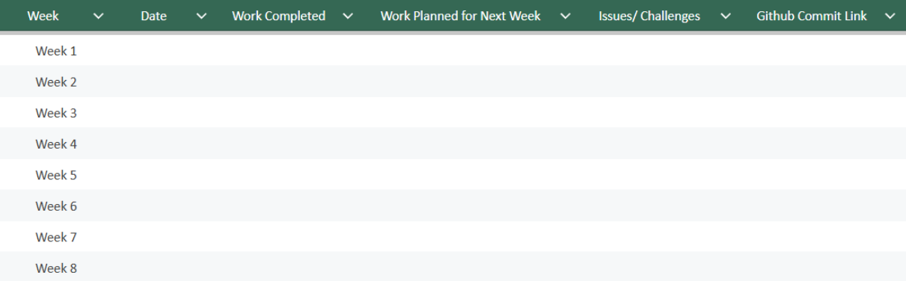
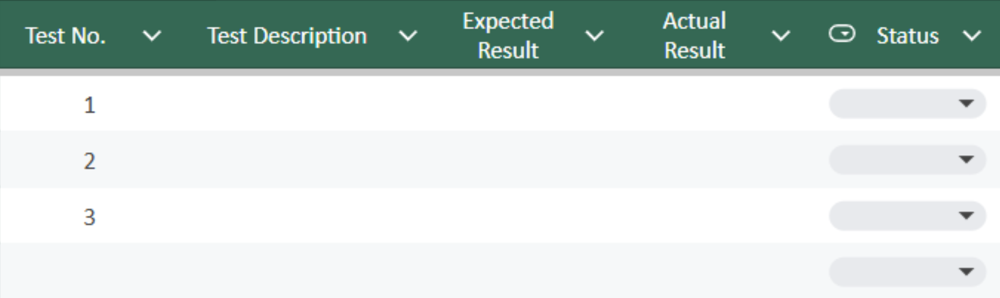
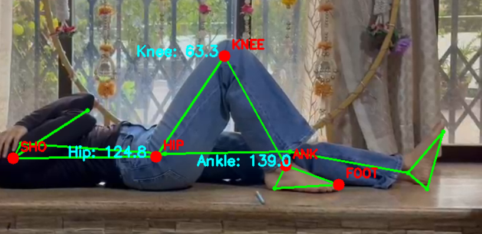

# BE Capstone Project

## Project Title
Fitonexa - The Smart Fitness Expert
---

## Team Details

| Sr. No. | Name of Student | Roll No. | Branch | Email ID |
|---|---|---|---|---|
| 1 | Paayal Kapoor | 44 | AURO | 2023.paayal.kapoor@ves.ac.in |
| 2 | Yash Patil | 53 | AURO | 2023.yash.patil@ves.ac.in |
| 3 | Sayalee Mahagaonkar | 48 | AURO | 2023.sayalee.mahagaonkar@ves.ac.in |
| 4 | Gauri Jaitapkar | 40 | AURO | 2023.gauri.jaitapkar@ves.ac.in |

---

## Guide Details

**Project Guide:** Dr. Sangeetha Prasanna Ram
**Department:** Automation and Robotics  
**Institute:** VESIT, Mumbai  

---

## Problem Statement

The aim of this project is to design and develop a system that solves the problem of manual and subjective assessment of physiotherapy exercises by automatically analyzing patient movement patterns using computer vision and pose estimation technology.

---

## Abstract

Physiotherapy exercises play a critical role in rehabilitation and recovery, but studies and clinical observations show that a large number of patients frequently perform prescribed exercises incorrectly when unsupervised. Incorrect posture, reduced range of motion, improper joint alignment, and inaccurate repetition execution can significantly reduce the effectiveness of rehabilitation and may even lead to delayed recovery or further injury. Continuous monitoring by physiotherapists is often impractical, creating the need for an automated and objective assessment system. 

This project proposes the development of an intelligent video-based rehabilitation monitoring system capable of analyzing patient exercise performance automatically. The system uses computer vision and pose estimation techniques to detect body landmarks from recorded exercise videos, extract key joint coordinates, calculate biomechanical angles, identify exercise repetitions, and segment movement into distinct motion phases for detailed analysis.
The implementation utilizes Python along with MediaPipe pose estimation, OpenCV for video processing, signal smoothing filters, and data analysis libraries such as NumPy and Pandas. The expected outcome is a system capable of accurately evaluating exercise quality, detecting movement deviations, and generating quantitative performance metrics. This system can be applied in physiotherapy clinics, home-based rehabilitation, tele-rehabilitation platforms, and remote patient monitoring systems.

---

## Objectives

1) To develop an indigenous physiotherapy assistance device that helps reduce the dependency on continuous in-person supervision by physiotherapists while enabling patients to safely perform rehabilitation exercises at home. 
2) To design and implement a computer vision–based motion analysis system capable of tracking patient movements in real time, extracting biomechanical features from key joints, specifically the knee joint and shoulder joint, across six commonly prescribed rehabilitation exercises.
3) To build an intelligent machine learning model that utilizes extracted joint angles and movement features to classify exercise execution as correct or incorrect and identify deviations in patient posture or movement patterns.
4) To provide real-time corrective feedback to patients by detecting improper exercise execution and suggesting movement corrections in order to reduce recovery time, prevent the risk of secondary injury, and improve rehabilitation effectiveness.
5) To validate the performance and clinical applicability of the device through pilot studies conducted in collaboration with three physiotherapy clinics, using expert-labelled exercise data provided by professional physiotherapists, and to document the findings through research publication.

---

## Scope of the Project

- Design and development of a prototype rehabilitation assistance device that can be mounted in front of the patient and capture exercise movements in real time.
- Development of a computer vision–based pose estimation system for detecting and tracking body landmarks during rehabilitation exercises using video input.
- Implementation of a biomechanical motion analysis pipeline to extract joint coordinates and calculate movement-based features such as joint angles for the knee and shoulder joints.
- Development of a machine learning model trained on extracted movement features to classify exercise performance as correct or incorrect based on expert-labelled physiotherapy data.
- Integration of a real-time feedback mechanism capable of identifying incorrect exercise execution and suggesting corrective actions to prevent further injury and improve recovery outcomes.
- Coverage of six rehabilitation exercises focusing on two major joints: the knee joint and shoulder joint.
- Data collection, pilot testing, and performance validation through clinical studies conducted across three physiotherapy clinics in collaboration with professional physiotherapists.
- Documentation of results and publication of research findings in the form of at least one research paper.
  
---

## Existing System

Phoenix by Sword Health
Sword Health introduced Phoenix, an AI Care Specialist that guides and reacts to members during their sessions through natural conversation, bringing the clinical experience and expertise of a clinician to wherever the patient is. Sword patients join sessions using a tablet from the company that can track their movement. Phoenix monitors their progress, and after each session summarises their performance data and sends it to one of Sword's human clinicians for review.
While Phoenix represents a significant step in AI-assisted rehabilitation, it carries several notable limitations. Its solutions, designed for employers and health plans, include tablets and wearable motion sensors — meaning the system requires proprietary hardware provided by Sword Health rather than a standard camera, making it inaccessible to smaller clinics or patients without corporate health coverage. Phoenix is available to over 10,000 employers across three continents, positioning it as an enterprise product rather than a clinic-level or individual patient tool. It is designed for general musculoskeletal conditions and does not address condition-specific rehabilitation such as the exercise protocols prescribed for slip disc patients. Additionally, the system still routes all AI recommendations through human clinicians for approval, meaning it cannot operate as a fully autonomous monitoring system.

Smart Mirrors
Smart mirrors are large display systems equipped with cameras and pose estimation software, typically mounted in a fixed location such as a clinic room or home gym. They overlay real-time skeletal tracking on the patient's reflection and provide visual or audio feedback on exercise form.
The core limitations of smart mirrors are accessibility and cost. The hardware itself is expensive to manufacture and install, making widespread deployment across physiotherapy clinics impractical. Because the mirror must be mounted in a fixed location, it cannot be used in a home setting without significant infrastructure. The systems are also designed primarily for upright exercises and general fitness movements, and have not been validated for supine rehabilitation exercises such as those prescribed for spinal conditions. Furthermore, most smart mirror systems rely on rule-based thresholds for feedback rather than patient-specific adaptive models, meaning they cannot account for the individual range of motion limitations common in clinical rehabilitation populations.

Fitness and Exercise Tracking Applications
Apps such as MyLift represent the consumer end of AI-assisted exercise monitoring. MyLift AI is a fitness coaching application that uses artificial intelligence to provide personalised workout guidance, exercise tracking and training recommendations. However, the AI coach is intended for general fitness guidance only — it is not a medical service, and the advice provided does not constitute professional medical, physiotherapy or dietetic advice. 
This distinction is fundamental. Consumer fitness applications are designed for healthy individuals performing gym exercises such as squats, deadlifts and bench press. They are not built for clinical populations with restricted range of motion, specific prescribed exercise protocols or conditions requiring careful monitoring of compensatory movements. They provide no mechanism for a physiotherapist to review session data, set patient-specific target ranges, or receive alerts when a patient performs an exercise incorrectly. The feedback these apps provide is generic rather than condition-specific, and none of them address supine rehabilitation exercises relevant to spinal conditions.

None of the existing systems combine condition-specific exercise monitoring, patient-specific adaptive feedback, edge-based real-time inference, and clinical accessibility in a single deployable device. Fitonexa addresses this gap by building a low-cost camera-based system using pose estimation and per-exercise machine learning classifiers that can be deployed directly in a physiotherapy clinic without proprietary hardware, enterprise contracts or internet dependency - while providing real-time, rep-level feedback calibrated to each patient's prescribed range of motion. 

---

## Proposed System

The proposed solution is the development of a low-cost intelligent physiotherapy assistance device capable of monitoring rehabilitation exercises in real time and providing corrective feedback to patients performing exercises at home. The system is designed to function as an assistive extension of the physiotherapist, allowing patients to continue rehabilitation outside clinical settings while reducing the risk of improper exercise execution, secondary injury, and delayed recovery.
The system works by capturing real-time video frames of the patient using an onboard camera. For each frame, body landmarks corresponding to the key joints required for a specific rehabilitation exercise are detected using the MediaPipe pose estimation model. Using the extracted joint coordinates, exercise-specific biomechanical angles are calculated using the three-point angle formula. The angle undergoing the highest range of motion is selected as the tracking angle, and rep detection logic is applied by identifying peaks or valleys in the movement data depending on the exercise being performed. Rep boundaries are then established, allowing individual exercise repetitions to be isolated for further analysis.
Each repetition is further segmented into multiple movement states representing different phases of exercise execution. Statistical features including mean, minimum, maximum, range, and standard deviation are computed for each state, creating the feature set used to build the training dataset. This data preparation pipeline enables detailed movement analysis while ensuring that error identification is specific to individual phases of an exercise.
The prepared dataset is then used to train multiple machine learning models, including Random Forest and Long Short-Term Memory (LSTM) networks, in order to determine the model that provides the highest classification accuracy. The best-performing model will subsequently be deployed on edge hardware for real-time inference and patient feedback. System performance and clinical applicability will be validated through pilot studies conducted across three physiotherapy clinics.
The major hardware components used in the system include an NVIDIA Jetson Nano 4GB Developer Kit for edge processing, a Logitech C922 Pro HD camera for video capture, a 7-inch HDMI display for user interaction and feedback visualization, a 64GB SD card for storage, and a 20,000 mAh battery pack for portable operation.
The expected outcome is an affordable and portable rehabilitation monitoring system capable of assisting physiotherapists by enabling accurate home-based exercise monitoring, reducing clinician workload, improving patient compliance, shortening recovery time, and preventing injuries caused by incorrect exercise execution.

---

## System Architecture



---

## Hardware Requirements



---

## Software Requirements



---

## Technologies Used

1) Python – Core programming language for backend development and ML pipeline.
2) NVIDIA Jetson Nano / Jetson Orin – Edge device for real-time on-device inference.
3) Computer Vision – Real-time analysis of patient movement through video input.
4) MediaPipe – Pose estimation and body landmark detection.
5) OpenCV – Video capture and frame-by-frame image processing.
6) Signal Processing – Noise reduction and smoothing of joint angle data.
7) Machine Learning – Classification of exercise performance as correct or incorrect.
8) Edge AI Deployment – Running trained ML models locally on embedded hardware.
9) Embedded Systems – Integration of camera, display, battery, and feedback modules.
10) Cloud Database – Storage and transmission of patient exercise session data.
11) Mobile/Web Application – Interface for physiotherapists to monitor patient progress.
12) Haptic and Audio Feedback – Real-time corrective feedback for patients during exercise.

---

## Methodology

1. Literature Survey
Research existing rehabilitation technologies, exercise monitoring systems, computer vision approaches, and currently available physiotherapy assistance solutions such as smart mirrors, rehabilitation platforms, and AI-based movement analysis systems.
2. Problem Identification
Identify the challenges in home-based physiotherapy rehabilitation, including incorrect exercise execution, lack of continuous physiotherapist supervision, high cost of existing solutions, and increased risk of delayed recovery or further injury.
3. Requirement Analysis
Determine the system requirements including supported rehabilitation exercises, key joints to be monitored (knee and shoulder), hardware components, camera specifications, real-time feedback mechanisms, machine learning requirements, and clinical validation needs.
4. System Design
Design the complete hardware and software architecture including edge device integration, camera setup, pose estimation pipeline, feature extraction workflow, machine learning inference system, feedback mechanisms, and physiotherapist monitoring interface.
5. Hardware / Software Development
Develop the embedded hardware prototype using the edge computing device and implement the software pipeline for pose estimation, joint angle calculation, repetition detection, state segmentation, feature extraction, and machine learning model development.
6. Integration
Integrate all system components including camera input, pose estimation model, machine learning inference pipeline, display unit, speaker system, haptic feedback module, cloud database, and physiotherapist application interface.
7. Testing and Validation
Train and evaluate machine learning models using collected exercise data, deploy the best-performing model on the edge device, and conduct pilot clinical validation studies at three physiotherapy clinics to evaluate system accuracy and usability.
8. Documentation and Publication
Document system architecture, implementation methodology, experimental results, and clinical validation outcomes, followed by preparation of research publication based on project findings.

---

## Project Timeline



---

## Weekly Progress Updates

 

---

## Design Files

Upload and link all design files here.

| File Type       | File Name / Link |          Description          |
| --------------- | ---------------- |          -----------          |
| CAD Model       |                  |                               |
| Circuit Diagram |                  |                               |
| PCB Design      |                  |                               |
| Flowchart       |  Flowchart.png   | System Architecture & Design  |
| Simulation File |                  |                               |
---

## Flowchart / Algorithm

 

---

### Algorithm

1) Start: The rehabilitation session begins when the patient powers on the device and initiates a therapy session.
2) Initialize the system: The edge device (Jetson Nano / Jetson Orin) initializes all hardware and software components, including the camera module, display unit, battery management system, audio feedback module, and the machine learning inference pipeline. The patient then selects the prescribed rehabilitation exercise through the device interface.
3) Read Input from Sensors/ User: The camera continuously captures real-time video frames of the patient while performing the selected exercise. These frames serve as the primary input to the system.
4) Process Data: Each captured frame is processed using the MediaPipe pose estimation model to identify exercise-specific body landmarks and joint coordinates. Using these coordinates, key biomechanical angles required for exercise assessment are calculated using the three-point angle formula. A repetition detection algorithm identifies exercise repetitions by tracking peaks or valleys in the movement of the tracking angle, depending on the exercise type. Frames belonging to each repetition are isolated and further segmented into movement states. Statistical features such as mean, minimum, maximum, range, and standard deviation are then calculated for each state to generate the feature set. These features are passed into the trained machine learning model deployed on the edge device for exercise classification.
5) Generate Output/ Feedback: The machine learning model classifies the exercise as correct or incorrect based on movement quality. If improper movement patterns are detected, the system generates corrective feedback indicating what adjustment the patient should make to prevent injury.
6) Display/ Store/ Transmit Results: Real-time feedback is delivered through visual cues on the display, audio feedback through the speaker system, and haptic feedback through the wristband. Once the exercise session is completed, session data is transmitted to the cloud database through HTTP requests. Summary reports and exercise performance data are then made available on the physiotherapist’s mobile/web application for review and monitoring of patient progress.
7) Stop: The rehabilitation session ends after the exercise routine is completed, all session data is stored successfully, and the device returns to standby mode awaiting the next session.

---

## Implementation Details

The project involves the development of an AI-powered physiotherapy rehabilitation assistance system capable of monitoring patient exercises in real time, analyzing movement quality, and providing corrective feedback. The system combines embedded hardware, computer vision, machine learning, and cloud connectivity to enable home-based rehabilitation under remote physiotherapist supervision. 

### Hardware Implementation

The hardware prototype is built around the NVIDIA Jetson Nano Developer Kit / Jetson Orin edge computing platform, which performs on-device processing and machine learning inference. A Logitech C922 Pro HD Webcam camera captures real-time video frames of the patient while performing rehabilitation exercises. A 7-inch HDMI display provides visual interaction and feedback to the patient during exercise sessions. A rechargeable 20,000 mAh battery powers the portable device, enabling standalone operation without continuous external power supply. An integrated speaker and amplifier module provides audio-based corrective feedback, while a wearable haptic wristband is included for vibration-based feedback cues. All hardware components are connected through the embedded processing board and enclosed in a portable prototype suitable for home-based rehabilitation use. 

### Software Implementation

The software system is primarily developed using Python. Real-time video frames captured by the camera are processed using MediaPipe pose estimation to identify exercise-specific body landmarks and joint coordinates. Using these coordinates, biomechanical joint angles are calculated through the three-point angle formula. A repetition detection algorithm identifies individual exercise repetitions by detecting peaks or valleys in movement data depending on exercise type. Each repetition is segmented into movement states, and statistical features such as mean, minimum, maximum, range, and standard deviation are extracted from each state. These features form the input dataset used to train machine learning models including Random Forest and LSTM networks. The best-performing model is deployed on the edge device for real-time exercise classification. Session data is transmitted to a remote database through HTTP requests and can later be reviewed by the physiotherapist through a mobile or web application. 

---

## Code Structure
```text
BE-Capstone-Project/
│
├── README.md
├── docs/
│   ├── literature_survey.md
│   ├── Heel_Slides.pdf
│   ├── Patient_Consent_Form.pdf
│   ├── PrivacyAssurance.pdf
│   ├── Q_Angle_Core_Compensation.pdf
│   ├── Shoulder_Anatomy.pdf
│   ├── Supine_Heel_Slides.pdf
│   └── IDAPT_Proposal.pdf
├── hardware/
│
├── software/
│   ├── FeatureExtraction_StatisticalAnalysis_SupineHeelSlides.py
│   └── Joint_Coordinates_Identification.py
│
├── images/
│   ├── System_architecture.png
│   ├── Hardware.png
│   ├── Software.png
│   ├── Tests.png
│   ├── Weekly_Progress.png
│   ├── Project_Timeline.png
│   └── Sample.png
│
└── references/
    └── Research_Paper_1_Ref_Goniometer.pdf
```
---

## How to Run the Project

Step 1: Set Up the Hardware
Connect all hardware components including the Jetson Nano / Jetson Orin, USB camera, HDMI display, speaker module, and power supply. Ensure the camera is positioned correctly in front of the patient.

Step 2: Install Required Dependencies
Install all required Python libraries and frameworks.
pip install mediapipe opencv-python numpy pandas scikit-learn tensorflow matplotlib. Also install the required NVIDIA JetPack SDK and Ubuntu dependencies for the Jetson device.

Step 3: Load the Pose Estimation and Machine Learning Models
Download the MediaPipe Pose Landmarker model and load the trained machine learning model used for exercise classification.
python download_model.py

Step 4: Run the Main Application
Start the rehabilitation monitoring system. The camera begins capturing real-time video frames and starts exercise analysis.
python main.py

Step 5: Perform the Prescribed Exercise
The patient stands or sits in front of the device and performs the exercise recommended by the physiotherapist. The system continuously tracks movement and analyzes exercise performance.

Step 6: Observe Output and Feedback
The system displays real-time corrective feedback on the screen and provides audio / haptic feedback whenever incorrect exercise execution is detected. Session data is stored locally and transmitted to the cloud database for physiotherapist review.

---

## Testing and Results

 


---

## Result Images / Videos

 


---

## Applications

1) Home-based Physiotherapy Rehabilitation – Enables patients to perform rehabilitation exercises safely at home without constant in-person supervision.
2) Remote Patient Monitoring – Allows physiotherapists to track patient exercise performance and recovery progress remotely.
3) Sports Injury Rehabilitation – Assists athletes in performing recovery exercises correctly while reducing the risk of reinjury.
4) Clinical Rehabilitation Support – Can act as an assistive tool for physiotherapists in clinics to automate exercise monitoring and assessment.

---

## Advantages

1) Reduces Physiotherapist Workload – Minimizes the need for continuous manual supervision during routine rehabilitation sessions.
2) Real-Time Corrective Feedback – Provides immediate visual, audio, and haptic feedback to prevent incorrect exercise execution.
3) Portable and Low-Cost Solution – Edge-based design makes the system more affordable compared to existing commercial rehabilitation systems.
4) Improves Recovery Outcomes – Helps patients perform exercises correctly, reducing injury risk and potentially shortening recovery time.

---

## Limitations

1) Exercise-Specific Training Required – The machine learning model must be trained separately for each rehabilitation exercise.
2) Dependence on Camera Positioning – Incorrect camera angle or poor lighting may reduce pose detection accuracy.
3) Limited Exercise Coverage – The current system is designed only for selected knee and shoulder rehabilitation exercises.
4) Clinical Validation Still Required – Large-scale testing is necessary to fully validate performance in real-world clinical settings.

---

## Future Scope

1) Expand Exercise Library – Support a larger number of rehabilitation exercises across additional joints and body movements.
2) Improve Model Accuracy – Train on larger datasets and explore more advanced deep learning architectures.
3) Wearable Sensor Integration – Combine computer vision with IMU or motion sensors for improved movement analysis.
4) Tele-Rehabilitation Platform Development – Develop a complete cloud-connected platform for remote physiotherapy sessions and long-term patient monitoring.

---

## Research Paper / Publication

| Item | Details |
|------|---------|
| Paper Title | Real-Time Pose Estimation for Resource-Constrained Edge Devices |
| Conference / Journal | To be decided |
| Paper Status | In Progress |
| Expected Submission Date | December 2026 |
| Paper Link | Yet to be published |

---

## References

[1] X. A. Yue, Y. Gu, and B. Yu, “Validation of Single-Camera MediaPipe BlazePose for Knee Joint Angle Measurement: Concurrent Validity, Inter-Rater Reliability, and Exploratory Test-Retest Reliability Across Multiple Functional Tasks,” submitted to JMIR Rehabilitation and Assistive Technologies, May 26, 2026. 


[2] R. Sharma, V. Vaibhav, R. Meshram, B. Singh, and G. Khorwal,
“A Systematic Review on Quadriceps Angle in Relation to Knee Abnormalities,”
PMCID: PMC9974941, PMID: 36874732.

---

## Declaration

We declare that this project work is carried out by our team as part of the BE Capstone Project. The work will be regularly updated on GitHub and all references used will be properly cited.

---
